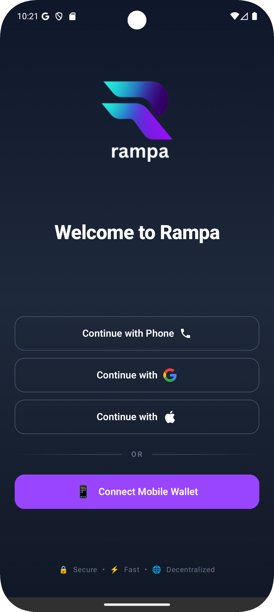

# Rampa Mobile 💰

[](https://kotlinlang.org/)
[](https://developer.android.com/)
[](https://solana.com/)
[](https://developer.android.com/jetpack/compose)


A modern Kotlin-based mobile application for Solana blockchain interactions, built for the Solana Mobile Hackathon.

## 📱 Screenshots

<table>
  <tr>
    <td></td>
    <td></td>
  </tr>
  <tr>
    <td align="center">Home Screen</td>
    <td align="center">Send Tokens</td>
  </tr>
</table>

<table>
  <tr>
    <td></td>
    <td></td>
    <td></td>
  </tr>
  <tr>
    <td align="center">Investment Portfolio</td>
    <td align="center">Profile</td>
    <td align="center">Transaction History</td>
  </tr>
</table>

## ✨ Features

### 🔐 Authentication & Security
- **Web3Auth Integration** - Secure wallet authentication
- **MWA** - Log in with your existing wallet (e.g. PhantomWallet or Solscan)

### 💸 Token Operations
- **Multi-Token Support** - USDC, EURC, BONK, and SOL
- **Send & Receive** - Fast and secure token transfers
- **Real-time Balance** - Live account balance updates
- **Transaction History** - Complete transfer records

### 📊 Investment Features
- **Portfolio Tracking** - Monitor your crypto investments
- **Stock Integration** - Track tokenized stocks (TSLA, NVDA, AAPL)
- **Real-time Prices** - Live market data updates

### 🎯 User Experience
- **Intuitive UI** - Clean and modern Material Design
- **Quick Actions** - Easy-to-use transfer interface
- **Token Switching** - Seamless multi-token management
- **Responsive Design** - Optimized for all screen sizes

## 🛠 Technology Stack

- **Language**: Kotlin
- **Framework**: Jetpack Compose
- **Blockchain**: Solana
- **Authentication**: Web3Auth
- **Architecture**: MVVM with Use Cases
- **DI**: Dagger Hilt
- **Networking**: Custom HTTP Driver
- **UI**: Material Design 3

## 🚀 Getting Started

### Prerequisites
- Android Studio Arctic Fox or newer
- Android SDK 24+
- Kotlin 1.8+
- Solana Mobile Stack (if testing on Solana Mobile)

### Installation

1. Clone the repository
```bash
git clone https://github.com/your-username/rampa-cash-mobile.git
cd rampa-cash-mobile
```

2. Open in Android Studio
```bash
studio .
```

3. Build and run
```bash
./gradlew assembleDebug
```

## 📱 App Architecture

```
app/
├── di/                    # Dependency Injection
├── navigation/            # Navigation setup
├── networking/            # HTTP client & API
├── ui/
│   ├── components/        # Reusable UI components
│   ├── screens/          # App screens
│   └── theme/            # Material Design theme
├── usecase/              # Business logic layer
├── viewmodel/            # UI state management
└── web3auth/             # Authentication logic
```

## 🔗 Key Components

- **MainScreen** - Dashboard with portfolio overview
- **SendScreen** - Token transfer interface
- **ReceiveScreen** - QR code and address sharing
- **InvestmentScreen** - Portfolio and stock tracking
- **TransfersScreen** - Transaction history
- **ProfileScreen** - User settings and wallet info

## 🏆 Hackathon Features

Built specifically for the Solana Mobile Hackathon with focus on:
- **Mobile-First Design** - Optimized for smartphone usage
- **Solana Integration** - Native blockchain interactions
- **User Onboarding** - Simplified crypto experience
- **Real-World Utility** - Practical daily use cases

## 📄 License

This project is licensed under the MIT License - see the [LICENSE](LICENSE) file for details.

## 🤝 Contributing

1. Fork the repository
2. Create your feature branch (`git checkout -b feature/AmazingFeature`)
3. Commit your changes (`git commit -m 'Add some AmazingFeature'`)
4. Push to the branch (`git push origin feature/AmazingFeature`)
5. Open a Pull Request

## 📧 Contact

Rampa: [https://rampa.cash/](https://rampa.cash/)

---

**Built with ❤️ for the Solana Mobile Hackathon**